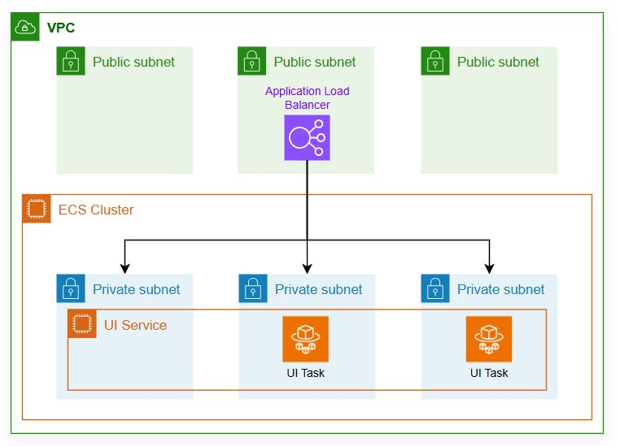
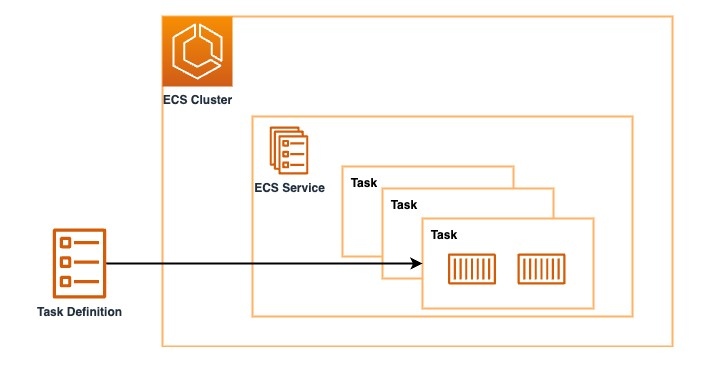

### 1. Deploying a Minimum Viable Product (MVP) on Amazon ECS

The development team has created a simple but elegant web application showcasing the store's product catalog. Mission is to deploy this single-container application using Amazon ECS.

Starting small is a smart strategy - it allows you to validate the infrastructure approach before the application grows in complexity. You'll deploy the initial version of the Stores web store and learn how to make updates as the business requirements evolve.

Below the architecture that we are going to deploy in this section.



### 2. Amazon ECS main components:

Amazon ECS has four components that is used to deploy an application.


1. Cluster: A logical grouping of services and tasks - your AnyCompany Stores infrastructure foundation
2. Service: A group of identical tasks - ensuring your web store stays running
3. Task: One or more containers performing a specific application function - your web application
4. Task Definition: Describes the task requirements (CPU, Memory, container images, networking type, IAM, etc.) - your application blueprint

### 3. Create Amazon ECS Cluster

Building the core components of Amazon ECS, including an ECS cluster, task definition, and ECS service. The goal is to deploy a container behind an Application Load Balancer (ALB).

Using the terminal to create an Amazon ECS Cluster named retail-store-ecs-cluster with enhanced CloudWatch Container Insights . Container Insights collects, aggregates, and summarizes metrics and logs from your containerized applications and microservices:

```
aws ecs create-cluster --cluster-name retail-store-ecs-cluster --region $AWS_REGION --settings name=containerInsights,value=enhanced
```

Now that you've created the cluster, proceed to the next step to create an Amazon ECS task definition for deploying the UI service.

### 4. Register the UI Task definitions

A task definition is a blueprint that describes how containers should run on Amazon ECS. It includes various configurations such as the container image to use, the required CPU and memory, the ports to open, and the environment variables needed.

| Parameter               | Description                                                                                                                   |
| ----------------------- | ----------------------------------------------------------------------------------------------------------------------------- |
| family                  | A name for multiple versions of the task definition, specified with a revision number.                                        |
| requiresCompatibilities | Determines where Amazon ECS launches the task or service based on the specified launch type.                                  |
| taskRoleArn             | An IAM role that allows the containers to call specified AWS APIs on your behalf.                                             |
| executionRoleArn        | An IAM role that grants the Amazon ECS container agent permission to make AWS API calls on your behalf.                       |
| networkMode             | The Docker networking mode for the containers in the task. For ECS Fargate, this is restricted to awsvpc mode.                |
| cpu, memory             | For Fargate, you need to use a valid combination of task-level CPU and memory.                                                |
| containerDefinitions    | Detailed information such as container image, port mappings, and health check settings for the container used in an ECS task. |

Let's create the task definition to be used for the UI Service:

Get the account_id and export it in env:

```
export ACCOUNT_ID=$(aws sts get-caller-identity --query Account --output text)

echo $ACCOUNT_ID
```

```
cat << EOF > retail-store-ecs-ui-taskdef.json
{
    "family": "retail-store-ecs-ui",
    "networkMode": "awsvpc",
    "requiresCompatibilities": [
        "FARGATE"
    ],
    "cpu": "1024",
    "memory": "2048",
    "runtimePlatform": {
        "cpuArchitecture": "X86_64",
        "operatingSystemFamily": "LINUX"
    },
    "containerDefinitions": [
        {
            "name": "application",
            "image": "public.ecr.aws/aws-containers/retail-store-sample-ui:1.2.3",
            "portMappings": [
                {
                    "name": "application",
                    "containerPort": 8080,
                    "hostPort": 8080,
                    "protocol": "tcp",
                    "appProtocol": "http"
                }
            ],
            "essential": true,
            "linuxParameters": {
                "initProcessEnabled": true
            },
            "healthCheck": {
                "command": [
                    "CMD-SHELL",
                    "curl -f http://localhost:8080/actuator/health || exit 1"
                ],
                "interval": 10,
                "timeout": 5,
                "retries": 3,
                "startPeriod": 30
            },
            "versionConsistency": "disabled",
            "logConfiguration": {
                "logDriver": "awslogs",
                "options": {
                    "awslogs-group": "retail-store-ecs-tasks",
                    "awslogs-region": "$AWS_REGION",
                    "awslogs-stream-prefix": "ui-service"
                }
            }
        }
    ],
    "executionRoleArn": "arn:aws:iam::${ACCOUNT_ID}:role/retailStoreEcsTaskExecutionRole",
    "taskRoleArn": "arn:aws:iam::${ACCOUNT_ID}:role/retailStoreEcsTaskRole"
}
EOF
```

```
aws ecs register-task-definition --cli-input-json file://retail-store-ecs-ui-taskdef.json
```

Retrieve the task definition using the AWS CLI:

```
aws ecs describe-task-definition --task-definition retail-store-ecs-ui
```

This command will display the full details of the task definition you just created.

### 5. Deploy the UI Service

An ECS service enables you to run and maintain a specified number of task definition instances simultaneously in an Amazon ECS cluster. If any tasks fail or stop for any reason, the ECS service scheduler launches another instance of your task definition to replace it, maintaining the desired number of tasks in the service. This ensures high availability for your application.

Amazon ECS services manage long-running applications, microservices, or other software components that require high availability. Amazon ECS services integrate with Elastic Load Balancing (ELB) to distribute traffic evenly across tasks in the service, providing a seamless way to deploy, manage, and scale your containerized applications.

Pre-requisite:

```
VPC
Internet Gateway
Public Subnet A
Public Subnet B
Private Subnet A
Private Subnet B
Elastic IP
NAT Gateway
Public Route Table
Private Route Table
```

Phase 1 – VCP

Step 1 – Set common environment variables

```
export AWS_REGION=us-east-1

export VPC_CIDR=10.0.0.0/16

export PUBLIC_SUBNET1_CIDR=10.0.1.0/24
export PUBLIC_SUBNET2_CIDR=10.0.2.0/24

export PRIVATE_SUBNET1_CIDR=10.0.11.0/24
export PRIVATE_SUBNET2_CIDR=10.0.12.0/24
```

Step 2 – Create the VPC

```
export VPC_ID=$(aws ec2 create-vpc \
    --cidr-block $VPC_CIDR \
    --tag-specifications 'ResourceType=vpc,Tags=[{Key=Name,Value=retail-store-vpc}]' \
    --query 'Vpc.VpcId' \
    --output text)
```

Step 3 – Enable DNS Support

```
aws ec2 modify-vpc-attribute \
    --vpc-id $VPC_ID \
    --enable-dns-support
```

verify:

```
aws ec2 describe-vpcs --vpc-ids $VPC_ID
```

Step 4 - Create Public Subnet 1

```
export PUBLIC_SUBNET1=$(aws ec2 create-subnet \
    --vpc-id $VPC_ID \
    --cidr-block 10.0.1.0/24 \
    --availability-zone us-east-1a \
    --tag-specifications 'ResourceType=subnet,Tags=[{Key=Name,Value=retail-store-public-subnet-1}]' \
    --query 'Subnet.SubnetId' \
    --output text)
```

Step 5 - Create Public Subnet 2

```
export PUBLIC_SUBNET2=$(aws ec2 create-subnet \
    --vpc-id $VPC_ID \
    --cidr-block 10.0.2.0/24 \
    --availability-zone us-east-1b \
    --tag-specifications 'ResourceType=subnet,Tags=[{Key=Name,Value=retail-store-public-subnet-2}]' \
    --query 'Subnet.SubnetId' \
    --output text)
```

Enable Auto-Assign Public IP for public subnet 1

```
aws ec2 modify-subnet-attribute \
    --subnet-id $PUBLIC_SUBNET1 \
    --map-public-ip-on-launch
```

Enable Auto-Assign Public IP for public subnet 2

```
aws ec2 modify-subnet-attribute \
    --subnet-id $PUBLIC_SUBNET2 \
    --map-public-ip-on-launch
```

Step 5 – Create and Attach an Internet Gateway

Create the Internet Gateway

```
export IGW_ID=$(aws ec2 create-internet-gateway \
    --tag-specifications 'ResourceType=internet-gateway,Tags=[{Key=Name,Value=retail-store-igw}]' \
    --query 'InternetGateway.InternetGatewayId' \
    --output text)
```

Attach the Internet Gateway to the VPC

```
aws ec2 attach-internet-gateway \
    --internet-gateway-id $IGW_ID \
    --vpc-id $VPC_ID
```

Step 6 – Create the Public Route Table

6.1 Create the Public Route Table

```
export PUBLIC_RT_ID=$(aws ec2 create-route-table \
    --vpc-id $VPC_ID \
    --tag-specifications 'ResourceType=route-table,Tags=[{Key=Name,Value=retail-store-public-rt}]' \
    --query 'RouteTable.RouteTableId' \
    --output text)
```

6.2 Add the Internet Route

```
aws ec2 create-route \
    --route-table-id $PUBLIC_RT_ID \
    --destination-cidr-block 0.0.0.0/0 \
    --gateway-id $IGW_ID
```

6.3 Associate Public Subnet 1

```
aws ec2 associate-route-table \
    --subnet-id $PUBLIC_SUBNET1 \
    --route-table-id $PUBLIC_RT_ID
```

6.4 Associate Public Subnet 2

```
aws ec2 associate-route-table \
    --subnet-id $PUBLIC_SUBNET2 \
    --route-table-id $PUBLIC_RT_ID
```

6.5 Verify

```
aws ec2 describe-route-tables \
    --route-table-ids $PUBLIC_RT_ID
```

Step 7 – Create Private Subnet

Step 7.1 – Create Private Subnet 1

```
export PRIVATE_SUBNET1=$(aws ec2 create-subnet \
    --vpc-id $VPC_ID \
    --cidr-block 10.0.11.0/24 \
    --availability-zone us-east-1a \
    --tag-specifications 'ResourceType=subnet,Tags=[{Key=Name,Value=retail-store-private-subnet-1}]' \
    --query 'Subnet.SubnetId' \
    --output text)
```

Step 7.2 – Create Private Subnet 2

```
export PRIVATE_SUBNET2=$(aws ec2 create-subnet \
    --vpc-id $VPC_ID \
    --cidr-block 10.0.12.0/24 \
    --availability-zone us-east-1b \
    --tag-specifications 'ResourceType=subnet,Tags=[{Key=Name,Value=retail-store-private-subnet-2}]' \
    --query 'Subnet.SubnetId' \
    --output text)
```

Step 7.3 – Verify both private subnets

```
aws ec2 describe-subnets \
    --subnet-ids $PRIVATE_SUBNET1 $PRIVATE_SUBNET2
```

Step 8 – Create the NAT Gateway

Step 8.1 – Allocate an Elastic IP

```
export EIP_ALLOC_ID=$(aws ec2 allocate-address \
    --domain vpc \
    --query 'AllocationId' \
    --output text)
```

Step 8.2 – Create the NAT Gateway

```
export NAT_GW_ID=$(aws ec2 create-nat-gateway \
    --subnet-id $PUBLIC_SUBNET1 \
    --allocation-id $EIP_ALLOC_ID \
    --tag-specifications 'ResourceType=natgateway,Tags=[{Key=Name,Value=retail-store-nat-gateway}]' \
    --query 'NatGateway.NatGatewayId' \
    --output text)
```

Step 8.3 – Wait until the NAT Gateway is available

```
aws ec2 wait nat-gateway-available \
    --nat-gateway-ids $NAT_GW_ID
```

You can also inspect it:

```
aws ec2 describe-nat-gateways \
    --nat-gateway-ids $NAT_GW_ID
```

Step 8.4 – Create the Private Route Table

```
export PRIVATE_RT_ID=$(aws ec2 create-route-table \
    --vpc-id $VPC_ID \
    --tag-specifications 'ResourceType=route-table,Tags=[{Key=Name,Value=retail-store-private-rt}]' \
    --query 'RouteTable.RouteTableId' \
    --output text)
```

Step 8.5 – Add the default route through the NAT Gateway

```
aws ec2 create-route \
    --route-table-id $PRIVATE_RT_ID \
    --destination-cidr-block 0.0.0.0/0 \
    --nat-gateway-id $NAT_GW_ID
```

Step 8.6 – Associate Private Subnet 1

```
aws ec2 associate-route-table \
    --subnet-id $PRIVATE_SUBNET1 \
    --route-table-id $PRIVATE_RT_ID
```

Step 8.7 – Associate Private Subnet 2

```
aws ec2 associate-route-table \
    --subnet-id $PRIVATE_SUBNET2 \
    --route-table-id $PRIVATE_RT_ID
```

Step 8.8 – Verify the private route table

```
aws ec2 describe-route-tables \
    --route-table-ids $PRIVATE_RT_ID
```

###### Phase 2 – Security Groups

Create the ALB Security Group

```
export ALB_SG_ID=$(aws ec2 create-security-group \
    --group-name retail-store-alb-sg \
    --description "Security group for Retail Store ALB" \
    --vpc-id $VPC_ID \
    --query 'GroupId' \
    --output text)
```

Allow HTTP from anywhere

```
aws ec2 authorize-security-group-ingress \
    --group-id $ALB_SG_ID \
    --protocol tcp \
    --port 80 \
    --cidr 0.0.0.0/0
```

Allow HTTPS

```
aws ec2 authorize-security-group-ingress \
    --group-id $ALB_SG_ID \
    --protocol tcp \
    --port 443 \
    --cidr 0.0.0.0/0
```

Create the ECS Security Group

```
export UI_SG_ID=$(aws ec2 create-security-group \
    --group-name retail-store-ui-sg \
    --description "Security group for Retail Store ECS Tasks" \
    --vpc-id $VPC_ID \
    --query 'GroupId' \
    --output text)
```

Allow traffic only from the ALB

```
aws ec2 authorize-security-group-ingress \
    --group-id $UI_SG_ID \
    --protocol tcp \
    --port 8080 \
    --source-group $ALB_SG_ID
```

Verify

```
aws ec2 describe-security-groups \
    --group-ids $ALB_SG_ID $UI_SG_ID
```

###### Phase 3: Load Balancer

Create the Application Load Balancer

```
export ALB_ARN=$(aws elbv2 create-load-balancer \
    --name retail-store-alb \
    --subnets $PUBLIC_SUBNET1 $PUBLIC_SUBNET2 \
    --security-groups $ALB_SG_ID \
    --scheme internet-facing \
    --type application \
    --ip-address-type ipv4 \
    --query 'LoadBalancers[0].LoadBalancerArn' \
    --output text)
```

Wait until the ALB is Active

```
aws elbv2 wait load-balancer-available \
    --load-balancer-arns $ALB_ARN
```

Create the Target Group

```
export UI_TG_ARN=$(aws elbv2 create-target-group \
    --name retail-store-ui-tg \
    --protocol HTTP \
    --port 8080 \
    --target-type ip \
    --vpc-id $VPC_ID \
    --health-check-protocol HTTP \
    --health-check-path /actuator/health \
    --health-check-port traffic-port \
    --query 'TargetGroups[0].TargetGroupArn' \
    --output text)
```

Create the HTTP Listener

```
aws elbv2 create-listener \
    --load-balancer-arn $ALB_ARN \
    --protocol HTTP \
    --port 80 \
    --default-actions Type=forward,TargetGroupArn=$UI_TG_ARN
```

Verify the ALB

```
aws elbv2 describe-load-balancers \
    --load-balancer-arns $ALB_ARN
```

Verify the Target Group

```
aws elbv2 describe-target-groups \
    --target-group-arns $UI_TG_ARN
```

###### All env variables:

```
echo $VPC_ID

echo $PUBLIC_SUBNET1
echo $PUBLIC_SUBNET2

echo $PRIVATE_SUBNET1
echo $PRIVATE_SUBNET2

echo $ALB_SG_ID
echo $UI_SG_ID

echo $ALB_ARN
echo $UI_TG_ARN
```

##### Let's create the ECS service:

1. Create the ECS Task Execution Role

```
cat > ecs-task-execution-trust.json <<EOF
{
  "Version": "2012-10-17",
  "Statement": [
    {
      "Effect": "Allow",
      "Principal": {
        "Service": "ecs-tasks.amazonaws.com"
      },
      "Action": "sts:AssumeRole"
    }
  ]
}
EOF
```

Create the role:

```
aws iam create-role \
    --role-name retailStoreEcsTaskExecutionRole \
    --assume-role-policy-document file://ecs-task-execution-trust.json
```

Attach the required managed policy:

```
aws iam attach-role-policy \
    --role-name retailStoreEcsTaskExecutionRole \
    --policy-arn arn:aws:iam::aws:policy/service-role/AmazonECSTaskExecutionRolePolicy
```

2. Create the ECS Task Role
   Use the same trust policy:

```
aws iam create-role \
    --role-name retailStoreEcsTaskRole \
    --assume-role-policy-document file://ecs-task-execution-trust.json
```

verify:

```
aws iam list-roles \
    --query "Roles[?contains(RoleName,'retailStore')].RoleName" \
    --output table
```

Create the CloudWatch Log Group

```
aws logs create-log-group \
    --log-group-name retail-store-ecs-tasks
```

Finally, creating the ECS service:

```
aws ecs create-service \
    --cluster retail-store-ecs-cluster \
    --service-name ui \
    --task-definition retail-store-ecs-ui \
    --desired-count 2 \
    --launch-type FARGATE \
    --health-check-grace-period-seconds 30 \
    --load-balancers targetGroupArn=${UI_TG_ARN},containerName=application,containerPort=8080 \
    --network-configuration "awsvpcConfiguration={subnets=[${PRIVATE_SUBNET1},${PRIVATE_SUBNET2}],securityGroups=[${UI_SG_ID}],assignPublicIp=DISABLED}" \
    --enable-execute-command
```

Once the service is stable, you can view the running tasks from the CLI:

```
aws ecs describe-tasks \
    --cluster retail-store-ecs-cluster \
    --tasks $(aws ecs list-tasks --cluster retail-store-ecs-cluster --query 'taskArns[]' --output text) \
    --query "tasks[*].[group, launchType, lastStatus, healthStatus, taskArn]" --output table
```

Retrieve the load balancer URL like:

```
export RETAIL_ALB=$(aws elbv2 describe-load-balancers \
    --names retail-store-alb \
    --query 'LoadBalancers[0].DNSName' \
    --output text)

echo $RETAIL_ALB
```

Paste the URL into a web browser to access the application.

### 6. Update the UI Task Definition
In this section, We'll learn how to update an ECS service. In this lab you will start by updating the UI Task Definition of the UI service. This process is useful for scenarios such as changing the container image or modifying the configuration.

Environment variables are one of the primary mechanisms used to configure container workloads, regardless of the orchestrator. We'll alter the configuration of the UI service by passing a new environment variable that will change the behavior of the workload. Since Docker images are immutable artifacts, environment variables are a convenient way to modify application behavior at runtime. In this case, We'll use the RETAIL_UI_THEME setting, which will change the default color theme for the application.

Environment variables are expressed in ECS task definitions with a name and a value like so:
```
"environment": [
    {
        "name": "RETAIL_UI_THEME",
        "value": "green"
    }
]
```
To update the UI task definition with the required environment variables you can run the lab-prep rolling script. The script will:

Generate the retail-store-ecs-ui-rolling-taskdef.json file
Print out the new task definition
Disable the session stickiness from the application Target Group.
```
lab-prep rolling green | jq
```
We will get an output similar to the one below:
```
{
    "family": "retail-store-ecs-ui",
    "executionRoleArn": "arn:aws:iam::${ACCOUNT_ID}:role/retailStoreEcsTaskExecutionRole",
    "taskRoleArn": "arn:aws:iam::${ACCOUNT_ID}:role/retailStoreEcsTaskRole",
    "networkMode": "awsvpc",
    "requiresCompatibilities": [
        "FARGATE"
    ],
    "cpu": "1024",
    "memory": "2048",
    "runtimePlatform": {
        "cpuArchitecture": "X86_64",
        "operatingSystemFamily": "LINUX"
    },
    "containerDefinitions": [
        {
            "name": "application",
            "image": "public.ecr.aws/aws-containers/retail-store-sample-ui:1.2.3",
            "portMappings": [
                {
                    "name": "application",
                    "containerPort": 8080,
                    "hostPort": 8080,
                    "protocol": "tcp",
                    "appProtocol": "http"
                }
            ],
            "essential": true,
            "linuxParameters": {
                "initProcessEnabled": true
            },
            "environment": [
                {
                    "name": "RETAIL_UI_THEME",
                    "value": "green"
                }
            ],
            "healthCheck": {
                "command": [
                    "CMD-SHELL",
                    "curl -f http://localhost:8080/actuator/health || exit 1"
                ],
                "interval": 10,
                "timeout": 5,
                "retries": 3,
                "startPeriod": 30
            },
            "versionConsistency": "disabled",
            "logConfiguration": {
                "logDriver": "awslogs",
                "options": {
                    "awslogs-group": "retail-store-ecs-tasks",
                    "awslogs-region": "$AWS_REGION",
                    "awslogs-stream-prefix": "ui-service"
                }
            }
        }
    ]
}
```
Now, use the register-task-definition command to update the task definition:
```
aws ecs register-task-definition --cli-input-json file://retail-store-ecs-ui-rolling-taskdef.json
```
It's important to note that ECS task definitions are immutable, meaning they cannot be modified after creation. Instead, the above command will create a new task definition revision, which is a copy of the current task definition with the new parameter values replacing the existing ones.

We can check that you now have multiple task definition revisions with the following command:
```
aws ecs list-task-definitions --family-prefix retail-store-ecs-ui --sort DESC --max-items 2
```


### 7. Update the UI Service
```
aws ecs update-service \
    --cluster retail-store-ecs-cluster \
    --service ui \
    --task-definition retail-store-ecs-ui \
    --force-new-deployment \
    --deployment-configuration '{
        "strategy": "ROLLING",
        "maximumPercent": 200,
        "minimumHealthyPercent": 100
    }'
```
While the deployment is still in progress, observe the application behavior by running the following command.
```
export RETAIL_ALB=$(aws elbv2 describe-load-balancers --name retail-store-ecs-ui \
 --query 'LoadBalancers[0].DNSName' --output text)

for i in $(seq 1 120)
do
    sleep 1
    curl --silent http://${RETAIL_ALB} | egrep "theme.+css"
done
```
or, see the number of running and pending tasks change, along with the deployment information, until only the newest task definition revision remains active.
```
aws ecs describe-services \
  --cluster retail-store-dev \
  --services ui \
  --query "services[0].[runningCount,pendingCount,deployments]"
```
